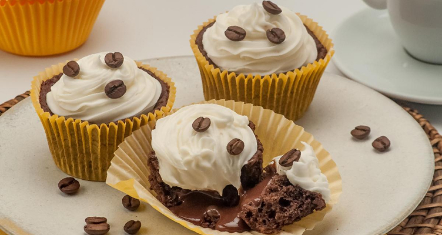

# 🍰 Recipe Page

Página de receita desenvolvida com HTML e CSS, focada na estruturação semântica e estilização de layout.

---

## 🚀 Technologies
- HTML5
- CSS3

---

## 📸 Preview


---

## 📚 About the Project
Este projeto consiste na construção de uma página estática de receita, apresentando:

- Estrutura semântica com HTML
- Organização de conteúdo (ingredientes e modo de preparo)
- Estilização com CSS
- Uso de fontes externas (Google Fonts)
- Aplicação de layout centralizado e visual limpo

---

## 🎯 Objective
Praticar conceitos fundamentais de desenvolvimento web, como:

- Estruturação de páginas com HTML
- Estilização com CSS
- Organização e hierarquia de conteúdo

---

## 📂 How to Run
```bash
# Clone the repository
git clone https://github.com/gabrielsants7/projeto_pagina_de_receita_rockseat.git

# Open the index.html file in your browser
